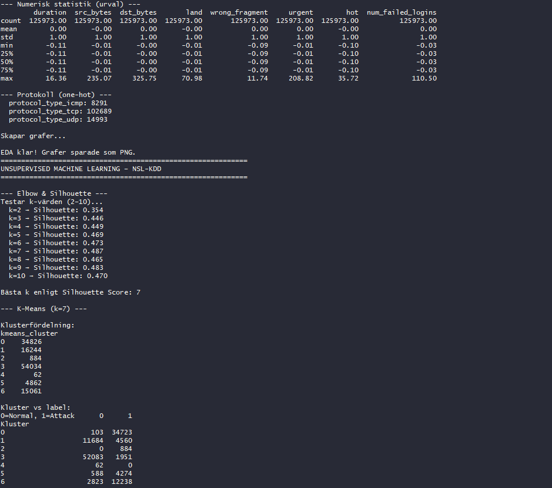
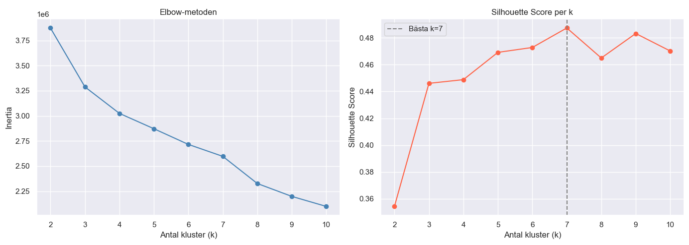
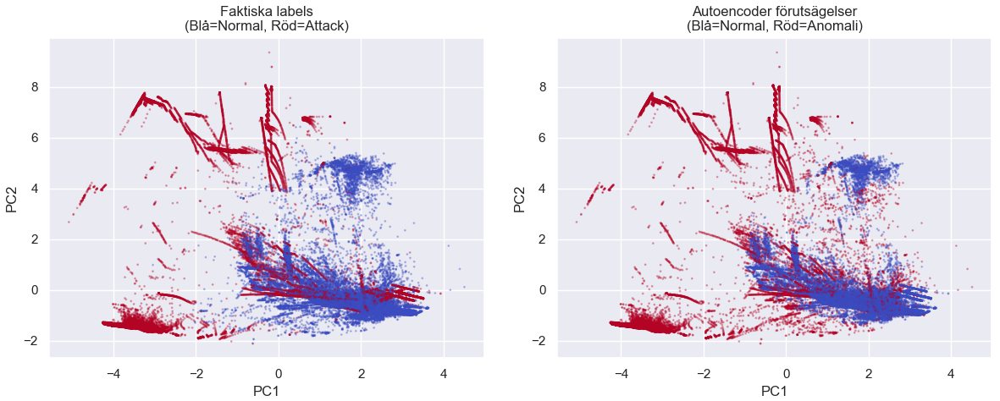

# NSL-KDD Dataset Analysis & Machine Learning

A machine learning and exploratory data analysis (EDA) project built using the **NSL-KDD intrusion detection dataset**. This project provides preprocessing, visualization, and analytical insights to help detect malicious network activity.


## Features

- Exploratory Data Analysis (EDA)
- Data visualization and statistical analysis
- Multiple graph-based insights
- Machine learning workflow support
- Clean and modular Python implementation
- Automatic graph rendering
- Easy setup with virtual environments


## Preview

### Dataset Analysis Preview




### Graph Visualization Preview






## Dataset

This project uses the **NSL-KDD Dataset**, an improved version of the KDD Cup 1999 dataset commonly used for:

- Intrusion Detection Systems (IDS)
- Cybersecurity research
- Network anomaly detection
- Machine learning classification tasks


## Installation

### Prerequisites

Make sure the following are installed:

- Python 3.10 or higher
- pip (Python package installer)


### Step 1: Clone the Repository

```bash
git clone https://github.com/Zaitex89/NSL-KDD-ML.git
cd NSL-KDD-ML
```

### Step 2: Create a Virtual Environment

#### Windows

```bash
python -m venv .venv
.venv\Scripts\activate
```

#### macOS / Linux

```bash
python3 -m venv .venv
source .venv/bin/activate
```

### Step 3: Install Dependencies

```bash
pip install -r requirements.txt
```


## Usage

### Run the Program

```bash
python main.py
```


## Output

The program generates:

- Full Exploratory Data Analysis (EDA)
- Multiple data visualizations
- Statistical summaries
- Relevant graphs and charts

> Note: A new graph window will appear after closing the current graph window.


## Example Analysis

The project may include visualizations such as:

- Attack type distribution
- Feature correlation heatmaps
- Traffic behavior analysis
- Normal vs malicious traffic comparisons
- Feature importance graphs


## Technologies Used

- Python
- Pandas
- NumPy
- Matplotlib
- Seaborn
- Scikit-learn


## Future Improvements

- Add model training pipeline
- Support additional ML algorithms
- Export graphs automatically
- Improve UI/UX for graph navigation
- Add real-time intrusion detection support

